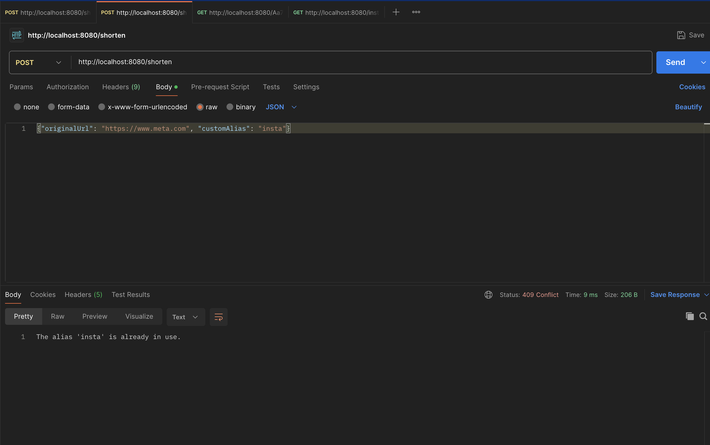

# URL Shortener Application

A fast, lightweight, and robust URL shortener service built with Spring Boot. It allows users to convert long URLs into easy-to-share short links and automatically redirects users who visit the short links back to their original destinations.

## Features

- **Shorten URLs:** Automatically generates a short, unique Base62 alias for any valid HTTP/HTTPS URL.
- **Custom Aliases:** Users can optionally specify their own custom alias for a URL.
- **Redirection:** Quickly redirects short links (`HTTP 301 Moved Permanently`) to the original URL.
- **Validation:** Ensures that only valid URLs are processed.
- **Metrics:** Integrated with Micrometer and Spring Boot Actuator for tracking API metrics (e.g., time taken to generate URLs and process redirects).

---

## Datastore

This application currently uses **Caffeine Cache** as an in-memory datastore. 
Caffeine is a high-performance, near-optimal caching library for Java. Because it operates entirely in memory, any generated URLs will be lost when the application is restarted. For a production environment, this repository interface can easily be swapped out for a persistent datastore (such as PostgreSQL, MySQL, or Redis).

---

## Endpoints

### 1. Shorten a URL
**Endpoint:** `POST /shorten`
**Content-Type:** `application/json`

**Request Body (Auto-generated code):**
```json
{
  "originalUrl": "https://www.google.com"
}
```

**Request Body (Custom Alias):**
```json
{
  "originalUrl": "https://www.google.com",
  "customAlias": "goog"
}
```

**Success Response (200 OK):**
```json
{
  "shortUrl": "http://localhost:8080/goog"
}
```

**Error Responses:**
- `400 Bad Request`: If the URL is invalid or empty.
- `409 Conflict`: If the requested custom alias is already in use.

### 2. Redirect to Original URL
**Endpoint:** `GET /{code}`

**Behavior:**
- Looks up the original URL associated with `{code}`.
- If found, responds with a `301 Moved Permanently` status and a `Location` header pointing to the original URL.
- If not found, responds with a `404 Not Found` status.

---

## Testing

The application is thoroughly tested to ensure reliability and correctness.

- **Unit Tests:** 
  - Tests individual components such as `UrlValidator`, `Base62GeneratorStrategy`, and the core business logic in `UrlServiceImpl`.
  - Built using **JUnit 5** and **Mockito** for mocking repository dependencies.
- **Integration Tests:** 
  - `UrlControllerIntegrationTest` boots up a complete Spring Context on a random test port and uses `TestRestTemplate` to issue real HTTP calls to the endpoints.
  - Ensures the HTTP statuses (`200 OK`, `301 Moved Permanently`, `409 Conflict`, `404 Not Found`) and JSON parsing are working seamlessly across the entire stack.

To run the test suite, execute:
```bash
./mvnw clean test
```

---

## Installation & Running Locally

### Prerequisites
- **Java 21** or higher.
- Maven is bundled within the project as a wrapper (`mvnw`), so a local Maven installation is not strictly required.

### Steps
1. **Clone the repository** and navigate to the project directory:
   ```bash
   cd urlshortener
   ```

2. **Run the application** using the Maven Wrapper:
   ```bash
   ./mvnw clean spring-boot:run
   ```

3. **Verify it's running:**
   By default, the server starts on port `8080`. You can test it by running:
   ```bash
   curl -X POST http://localhost:8080/shorten \
     -H "Content-Type: application/json" \
     -d '{"originalUrl": "https://example.com"}'
   ```

---

## Screenshots


**1. POST Request (Shorten URL)**

 


**2. GET Request (Redirect)**

 


**3. Error Handling (Duplicate Alias or Invalid URL)**


